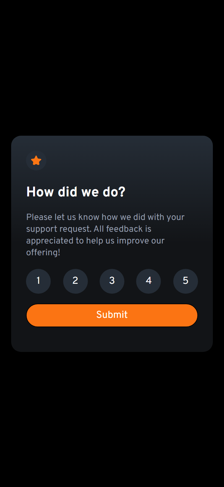
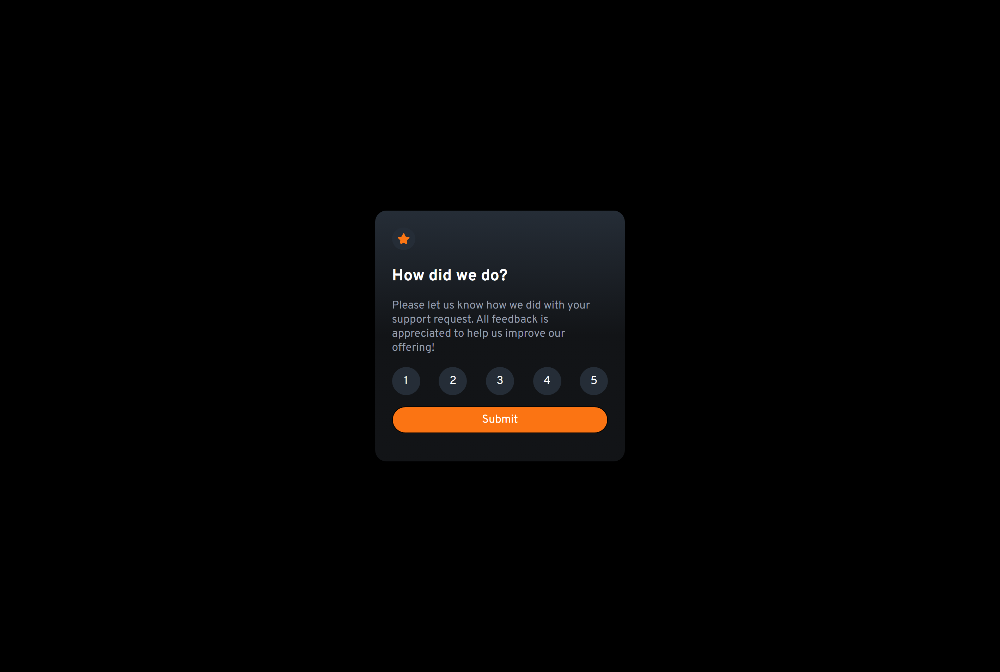
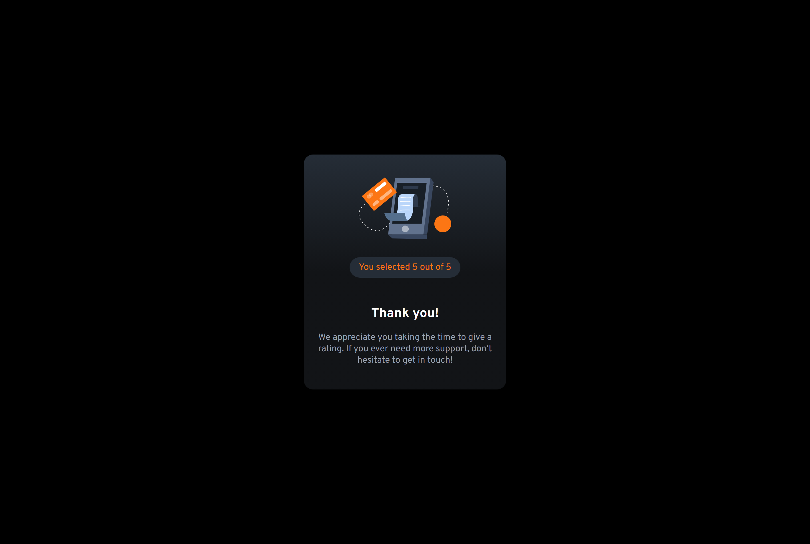

# Frontend Mentor - Interactive rating component solution

This is a solution to the [Interactive rating component challenge on Frontend Mentor](https://www.frontendmentor.io/challenges/interactive-rating-component-koxpeBUmI).

## Table of contents

- [Overview](#overview)
  - [The challenge](#the-challenge)
  - [Screenshot](#screenshot)
  - [Links](#links)
- [My process](#my-process)
  - [Built with](#built-with)
  - [What I learned](#what-i-learned)
- [Author](#author)

## Overview

### The challenge

Users should be able to:

- View the optimal layout for the app depending on their device's screen size
- See hover states for all interactive elements on the page
- Select and submit a number rating
- See the "Thank you" card state after submitting a rating

### Screenshot

#### Mobile preview

#### Desktop preview

#### Active state preview

### Links

- [Github repo](https://github.com/nurmarief/fementor_interactive-rating-component/)
- [Live site](https://nurmarief.github.io/fementor_interactive-rating-component/)

## My process

### Built with

- Semantic HTML5 markup
- SASS
- BEM CSS
- Flexbox
- Mobile-first workflow
- Webpack 5
- Vanilla Javascript

**Note: These are just examples. Delete this note and replace the list above with your own choices**

### What I learned

In this challenge, I mainly learn about manipulating DOM with javascript, especially manipulating form element.

## Author

- [@nurmarief](https://www.frontendmentor.io/profile/nurmarief)
